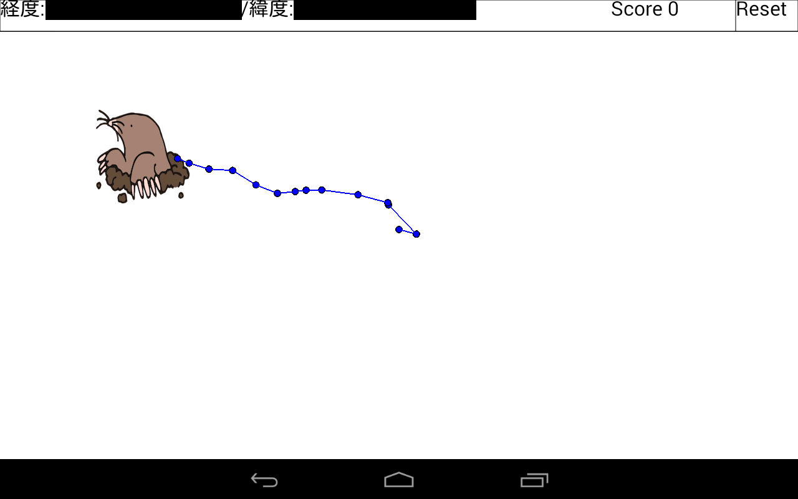
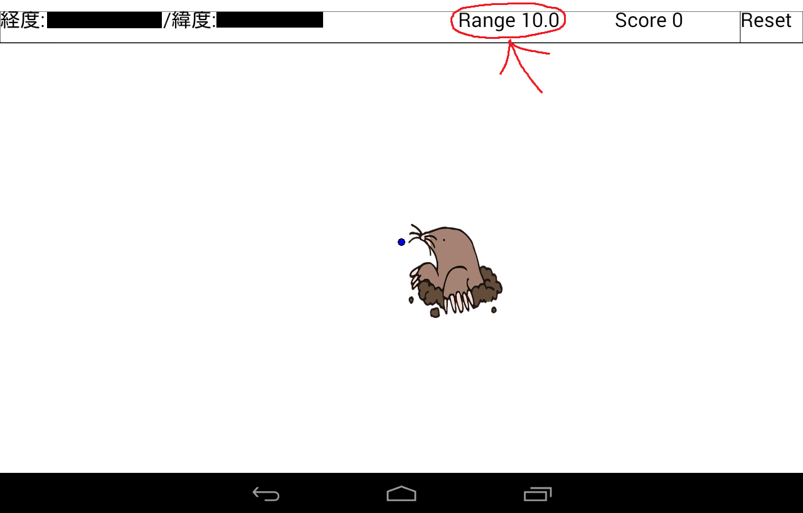

# GPSを活用したモグラたたきゲーム

`Processing3`で作成され、AndroidOSを搭載するスマートフォン上で動作するゲーム。GPSを使用したゲームで移動するごとに点がプロットされていく。`モグラ`のイラストが表示されている場所まで移動すると、得点が`+1`され、次の目的地にモグラが表示される。

#### 仕様

- Processing3でスマホのセンサーを使用する`keitai`ライブラリをimportする
- androidスマホで画面を表示するための`android`ライブラリをimportする

#### スクリーンショット

- `Range`オプションをピンチイン・アウトで変更することができ、地理的な距離を変更できる。小さな公園でのプレイから、都市全体を使ったプレイまで楽しむことができるよ。

